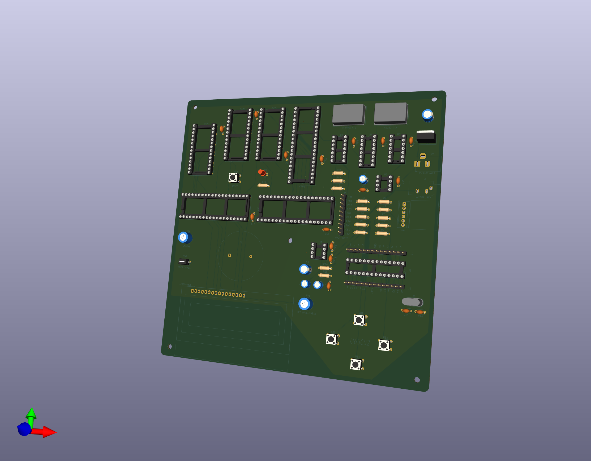
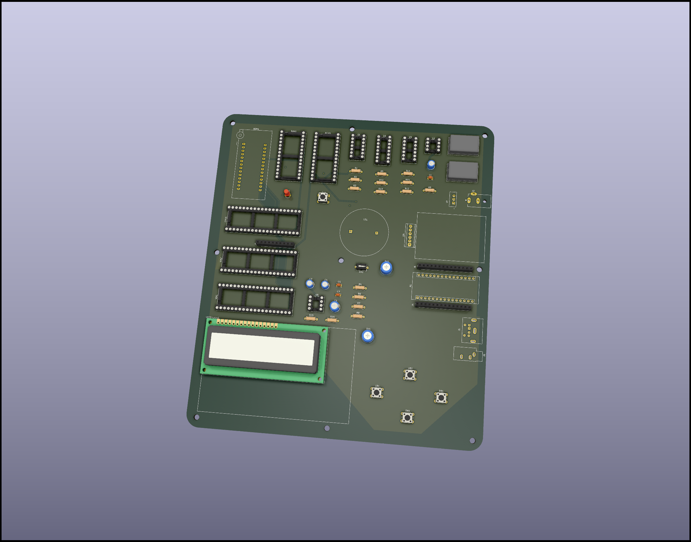
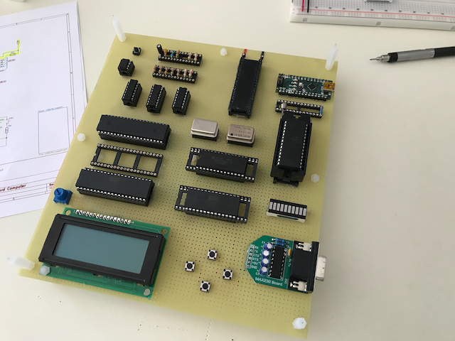
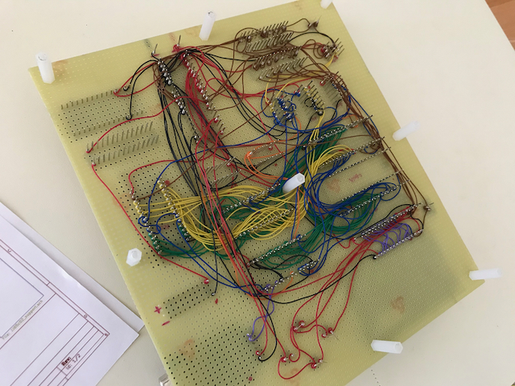
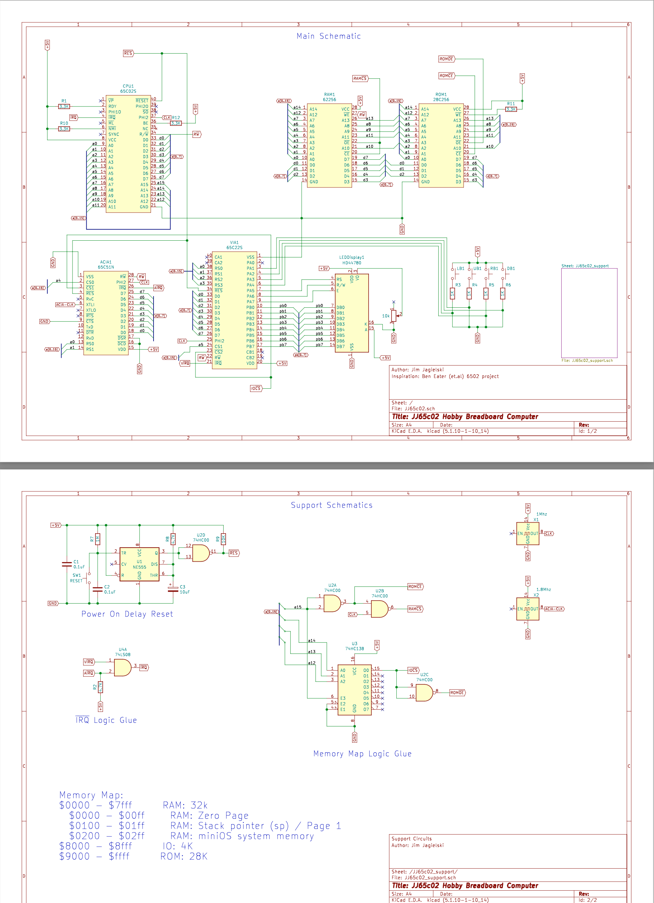
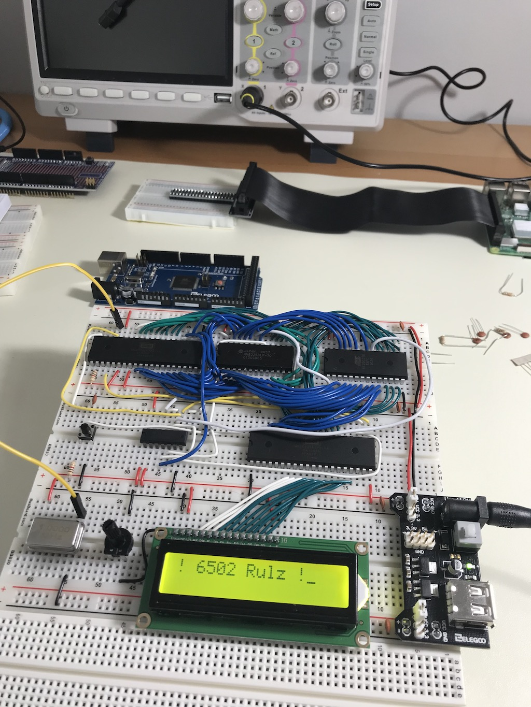

# History and Changelog for the JJ65c02 Project

## Intro

This document is mostly for my own personal note taking,
but hopefully it will also be useful to anyone who
comes across this project (I don't expect a lot of
traffic... :/ ). All code and examples are available under
permissive Open Source licenses, so please don't hesitate
to use, and re-use, what you need.

## The Historical Documents

### Jan 22, 2022

Apologies for such the long delay between updates. There has actually been a lot done over the last month, even though the amount of free time available to work on the project has grown somewhat limited.

The good news is that the new design I mentioned below has been set, ordered, and the PCBs delivered. Soldering is starting. I'm really happy with both the schematics and the PCB layout, and upgrading from Kicad5 to Kicad6 was pretty painfree.



Some not so obvious updates are 0.1uf caps on all ICs, a switch to disconnect/connect the on-board speaker, an ATMEGA328 chip socketed on the board, and header pins for access to the VIA2 and ATMEGA328 pins.

I already have some ideas for the v4 design, but my plan for the next several weeks is to work on the miniOS bootloader system, and build more sophisticated sound capability using the ATMEGA chip. I'm also thinking about what cool stuff I could do with SPI, but then again, I don't want to make this system so unique and one-off that whatever I do can't be used by anyone else, so I'll spend some time thinking about what is best.

--

### Dec 20, 2021

So while waiting for my PCBs, which were actually received about a week before they were expected, I put some thought and effort in the direction I wanted to go on the project from this point. Following on what others have done, their projects have really taken on a reality of their own. It is sometimes overwhelming to follow the posts on [https://new.reddit.com/r/beneater/](https://new.reddit.com/r/beneater/) and see some of the really extensive work people have put into this.

For example, so many people have now added VGA capability, so that along with their PS2 keyboards, they can get the full experience without using a PC. Currently, all my "real" I/O is done via TTY-RS232 and so my main interface with the system is using my Mac as a terminal (*vt200* and/or *Xterm*). Not needing that sure seemed alluring to me, at least for awhile.

But then I started thinking about how I'll be using my breadboard (funny how I'm still calling it a "breadboard" when I moved on from that for awhile now), and the need to be able to transfer data and files from my Mac to the breadboard is a vital part of that. In other words, even if I did fully add VGA and PS2 keyboard capability, I'd _still_ need a RS232 connection to transfer over BASIC programs and RAM-based 6502 assembled code. At which point, I thought, what does the VGA and PS2 stuff even do for me, other than add complexity, chip-count, and costs. Also, to be honest, I feel that moving too much in that directly makes less and less of what I'm doing usable by "rank and file" BE6502 enthusiasts... my system would be so specialized that little of what I do could be used by others.

And so I've decided on keeping things somewhat "basic" and "old school" with the hope that whatever I do, either hardware or software-wise, others will find usefulness, or, at least, inspiration, from my work. I also am cost-conscious as well, knowing that boards and chips aren't cheap, and so I'm careful in choosing what extra capability I add based on the costs associated with it.

But that doesn't mean that I'm not using newer technology where appropriate. For example, I've used the MAX323 UART board for my RS232 interface, and this seems in keeping with the spirit of the effort. I'm also working on migrating to the FT234 chip instead, for full hardware handshaking support, but also to avoid having to use the old DB9 connections.

The other big effort I'm looking into as well is using the Arduino Nano, or more than likely just the bare ATMega328p chip, as a soundwave generator. Right now what I have is super basic, just generating square waves on a VIA pin (pretty much what the Apple][ did), but I'd like a little more flexibility. Also, offloading sound generating to specialized hardware is something that even old-school 6502-based systems did, so I don't feel like I'm cheating all that much.

The unfortunate point of all this is that my newly delivered PCB boards were obsolete even before I got them. So it's back to revising schematics and layouts as I test options on my wirewrap-breadboard hybrid.

--

### Dec 11, 2021

In the spirit of "every onwards and upwards" I've decided to take the plunge and try my hand at creating a PCB. What's great is that Kicad includes that capability natively, and so the real work is in making sure that the part footprints are correct, and then in the actual routing of the traces.

There is a LOT of debate regarding manual-vs-auto routing, but I'll be honest, I found autorouting pretty good. Now, Kicad doesn't natively support it, so I had to export a DSN file and then use the Open Source Freerouting tool, but that was pretty easy. And the routes that it generated were, at least to me untrained eye, pretty good. I did do some manual cleanups when I imported the SES file back into Kicad, but I was happy with the result.

As my initial PCB, I didn't push things too hard. I left a somewhat generous amount of room on the board and used 12mil traces for power, and 10 for the default trace widths. I also used 4 layers, again making things as easy as possible.

The files have been shipped to JLCPCB for production and I should get them before the holiday, so I'll have some updates once they get delivered and I populate them.



### Dec 01, 2021

I've planned on adding a ROM-based BASIC since the start, and now that the miniOS bootloader is "ready", I started the work in earnest. The question was, of course, which BASIC to use, with the top 3 contenders being [EhBASIC](http://retro.hansotten.nl/6502-sbc/lee-davison-web-site/enhanced-6502-basic/) (Enhanced BASIC), [MS BASIC](https://github.com/mist64/msbasic), and BBC BASIC. I decided on EhBASIC because it seemed the fastest and most capable, as well as having acceptable licensing terms (for non-commercial use). Unfortunately, the porting to the `cc65` toolchain required some work.

I used the KrisOS work-in-progress version as a starting point, which had already changed some of the zeropage assignments to the standard `.res` formats. Unfortunately, there was still a lot of work needed to provide the correct spacing since EhBASIC loads some code chunks from ROM to RAM (in page0) and unless you have the spacing correct, you'll break everything. The fact that EhBASIC also re-uses the same zeropage allocations for different variables makes the situation even worse. So what I did was dump a full zeropage mapping of an unported EhBASIC and used that to work backwards on ensuring all variables and labels were where they were expected to be, regardless of where the starting point was.

Once that was done, I jumped in on cleaning up the code and standardizing the syntax formatting. This involved lowercasing all opcodes and making sure that all labels used colons. After that, it was fixing CNTRL-C handing and then adding in an `EXIT` command to return from the Interpreter back to miniOS.

Lots of work, but know there's an up-to-date version of EhBASIC ported to the `cc65` toolchain for others to use and expand on! My little contribution to the cause.

--

### Nov 22, 2021

Wow. Has it really been almost a month? Crazy. Anyway, I've been working off and on on the project since my last update. The 2 biggest changes have been, number 1: updates to the schematics (and wire-wrapping a new prototype) due to change number 2: adding in basic sound support.

There were a few ways to fold in sound; one would have been to add a dedicated sound chip to the prototype, and this may actually happen at some point. But the easiest was to use the existing _VIA_ chip to generate a square wave output, and use that to drive a mini _LM386_ based amplifier, so that's what I did.

Because the _PB7_ pin is already being used, I opted for the _CB2_ method, where we set a shift rate/pattern and shift register and then run the _VIA_ in free-running mode. This creates a user-specified square wave on _CB2_ that then gets fed into the _LM386_. The signal is quite low, and so I needed a pretty hefty gain on the amp, which caused it to pick up some noise, mostly from the clock signals. A low pass filter notched at around 10kHz worked well to clean that up. 

The sound addition did result in an increase in parts, over-and-above the actual _LM386_ itself, but these were limited to standard resistors and caps. Still, maybe going a dedicated sound chip may have been the better choice.

--

### Oct 26, 2021

Lots of updates since the last posting. So many, in fact, that I
think I am just about ready for a 1.0 release of the ***minios*** ROM+Bootloader
software.... Where to start?

Well, first of all I started in earnest the whole "transfer the RAM
image to RAM" stuff. I had already decided that I'd use the *XMODEM*
protocol for that, mostly because there was a well-known and well-used
6502-based software implementation already available. But that implementation
used *XMODEM/CRC* and, at least on the various terminal emulation packages
I tried, there was really spotty and/or buggy versions of that. Either
the host software used *XMODEM* *Checksum* or else there was something else,
but I had failures at least half the time.

It wasn't all bad though, because while trying to track down the
issues with *XMODEM*, I went ahead and implemented ACAI Rx IRQ handling;
my thought was maybe it was overrun issues and buffering the input
would address that. It didn't, but moving to an read buffer made sense
no matter what. To make it super easy, I allocate 256bytes for the buffer,
that way we automatically overwrite "old" data since the index pointers
are 8bits and can just increment them and not worry about over-writing
buffer space. And since my build doesn't include any hardware flow
control, a read buffer is even more advantageous.

After some reasearch, it looked like *YMODEM* and *ZMODEM* were viable
options, but the amount of work required for *ZMODEM* hardly seemed
worth the effort. *YMODEM* is basically a formal improvement over
*XMODEM* and so the vast majority of the existing code could be re-used.
And I found that *YMODEM* support was both more ubiquitous and standardized.
So *YMODEM* was it. And it works like a dream

Because of the read buffer, this meant that I needed to adjust my
memory mapping again, although not the address decoder logic at all.
I've set aside a full 768bytes for *SYSRAM* which give me some room
for growth and allows me to finalize, at least for now, the
starting address for RAM-based code.

Next on task was working out the specifics of assembling loadable
RAM images using `cc65` setup I have for building ***minios***. The
only real tricky part was in ensuring that the RAM code had access
to the exported functions and memory block of the ROM code. There are
2 main ways of doing this.

First of all, one could create an include file that defines the
names of all such exports and associates them with their actual
address. `cc65` can create both a "label" file and a "map" file
that includes such info, but not in an easily consumable format.
That would would require some sort of small scriptlet that reads
one of those files and creates a `exports.h` file.

The other is to simply have the build process for the RAM code
link against the ROM code, and have `ld65` do all that for us
automatically. My first attempt was to archive all the ROM code
object files into a library using `ar65` and link against that,
but the indexing that `ar65` does messed up the addressing. So
instead it links against all the individual object files, which
works great, but is ugly. I've included a small example in the
***minios*** distro to explain the details and provide a template
to follow.

So at this point, both the hardware build and the software ROM
has all the initial functionality I wanted, and it runs well
and reliably up to 4Mhz. A 1.0 release is warranted for sure.

But there's so, so much more I want to do...

--


### Oct 20, 2021

Over the last week or so, I've been focusing mostly on the hardware
aspects of the JJ65c02 project. As noted below, this included some
modifications to the address decoder and chip select circuits. Once
I was happy with that, I decided to make the transition from breadboard
to wirewrap.

Obtaining wirewrap supplies was a bit more difficult than I expected,
especially in the variety and selection of wirewrap tools and wire.
Still, Jameco and DigiKey had all I needed and my orders were shipped
and received in record time.

One thing I recalled was that for cross-talk reduction (especially true
for faster speeds), one needs to trade off beauty for function, and so
for the most part I routed lines in the same generic path, I also ensured
that I also choose different routes occasionally. I'm pretty happy with
how it turned out.




For the keen eyed among you, you may have noticed that I'm using
an Arduino Nano for my on-board power supply. This means that it's
available for any future tasks I may find for it. I've also added
another empty socket for another VIA chip, again for future
expansion.

--

### Oct 17, 2021

Again considering design considerations which would allow
the JJ65c02 to run as fast as possible, without major alterations
to the BE6502 concept, I've started looking again at the chip
select decoder logic. This is, after all, the slowest path,
after the very slow ROM speed (150ns). The propagation delays
in the chips are slow, but if you cascade enough of them, they
become problematic, especially at faster speeds. Considering
that at 4Mhz, for ROM access, the maximum that the propagation
delay can be is ~60ns, the use of the `74HC138` is, although
acceptable, maybe a little too short sighted. Instead, I'm moving
to the faster `74AC138` and making some other slight changes to
the glue logic. Worse case, I'm looking at a ~24ns delay, which
leaves a small but allowable window.

--

### Oct 15, 2021

##### How simple vs how complex

There are almost always improvements that can be done, and the
tough part is determining what to go ahead with and what to skip.
I see a lot of the various BE6502 designs which have evolved into
these wonderfully professional setups, with bank switching, VGA (at
least) drivers, super high clock speeds, etc. and I marvel at, and
respect the amount of work, skill and talent that have gone into
them. But at some point, at least to me, that moves moving past
what the original goal or intent was: a simple, basic but workable
6502-based hobby "computer".

All those cool features add a lot of complexity, a lot of chips and
a lot more money. Yeah, it's cool to play around with how far one
can stretch what a WDC65c02 chip can do (and [Dawid Buchwald](https://hackaday.io/project/174128/logs) is doing
some impressive work there), but I'm resisting going too far in
that direction.

As an example, even though the WDC65c02 can be driven at upwards of
14Mhz, doing so drastically changes the design and complexity. Heck,
even going to around 5Mhz with the "basic" BE6502 design is hard,
since the ROM itself limits you with its 150ns rating. Going faster
means either adding some wait states, or clock manipulations, and
well as increasing the complexity of the address decoder design
and avoiding individual logic gates quite a bit. After a while the
whole design starts looking like V'Ger from *Star Trek The Motion
Picture* where you have this incredible complex and powerful machine
build around an ancient, almost inconsequential core.

So as much fun as it would be to see how I would approach that
challenge, instead I want whatever I do to be usable, or at least
approachable, by those with a basic BE6502 setup willing to make
some small, minor changes/improvements.

--

### Oct 10, 2021

##### The memory map:

The current memory map is as efficient and as functional as
I could devise (currently, that is). The intent was to maximize
RAM, and then ROM, and then ensure adequate set-aside for I/O.

To that end, the address and chip select decoder logic for
RAM is super easy. If _a15_ is 0, then we're in RAM space,
and we can use the full 32k. Alternatively, _a15_ high (1),
means we are in ROM territory, but we also want to carve out
a small chunk of that space for I/O.

For I/O, the design uses the `W65c22` and the `w65c51`
as the VIA and ACIA chips, respectively. Now most I/O, especially
using these chip, don't need a large address space, and
even 4K is excessive, but workable. To maximize ROM space,
I use a `74hc138` and consider the states of address lines _a14_, _a13_
and _a12_. If these are all low (0), then, with _a15_ also low,
that maps to the $8000-$8fff address space. We can use that as
a chip select for the I/O chips; If any are high however, that
means that we are in ROM space, and so we can use that as the
other ROM chip select signal.

So now that we are choosing the I/O chips, how do we determine _which_ chip
we actually want to enable? What I came up with is an elegant solution
where address lines _a4_, _a5_,... are used for the secondary
chip select. So, in this case, if _a4_ is high, we select the ACIA;
if _a5_ is high, we pick the VIA. We can continue this way for up
to 6 more chips. This leaves _a3_->_a0_ to select the actual address
in these mini-blocks allocated per chip:

```
a11  a10  a9  a8  a7  a6  a5  a4  |  a3 a2 a1 a0  |    Address
  0    0   0   0   0   0   0   1  |   x  x  x  x  |  $8010-$801f
  0    0   0   0   0   0   1   0  |   x  x  x  x  |  $8020-$802f
  0    0   0   0   0   1   0   0  |   x  x  x  x  |  $8040-$804f
  0    0   0   0   1   0   0   0  |   x  x  x  x  |  $8080-$808f
  0    0   0   1   0   0   0   0  |   x  x  x  x  |  $8100-$810f
  0    0   1   0   0   0   0   0  |   x  x  x  x  |  $8200-$820f
  0    1   0   0   0   0   0   0  |   x  x  x  x  |  $8400-$840f
  1    0   0   0   0   0   0   0  |   x  x  x  x  |  $8800-$888f
```

Note that overlapping address spaces (like $8030, where _a4_ *and* _a5_
are both 1) are not used since this would select multiple I/O chips.

--

### Oct 5, 2021

Updated the schematics and the code for the new memory map. Kinda premature
though since I haven't yet physically changed the breadboard yet. Still,
I think there should be no problem.

```
MEMORY
{
  ZP:   start = $0,    size = $100,  type = rw, define = yes;
  RAM:  start = $0200, size = $7e00, type = rw, define = yes, file = "%O.bin";
  IO:   start = $8000, size = $1000, type = rw, define = yes, fill = yes, fillval = $ea, file = %O;
  ROM:  start = $9000, size = $7000, type = ro, define = yes, fill = yes, fillval = $ea, file = %O;
}

SEGMENTS {
  ZEROPAGE:  load = ZP,  type = zp,  define = yes;
  SYSRAM:    load = RAM, type = rw,  define = yes, optional = yes, start = $0200;
  PROG:      load = RAM, type = rw,  define = yes, optional = yes, start = $0300;
  DATA:      load = ROM, type = rw,  define = yes, optional = yes, run = RAM;
  BSS:       load = RAM, type = bss, define = yes, optional = yes;
  HEAP:      load = RAM, type = bss, define = yes, optional = yes;
  CODE:      load = ROM, type = ro,  define = yes,  start = $a000;
  RODATA:    load = ROM, type = ro,  define = yes, optional = yes;
  RODATA_PA: load = ROM, type = ro,  define = yes, optional = yes, align=$0100;
  ISR:       load = ROM, type = ro,  start = $ffc0;
  VECTORS:   load = ROM, type = ro,  start = $fffa;
}
```



Even though I don't ever expect to move to using PCBs, wirewrapping is the next and likely final step, I decided to play around with designing and laying
out the design. Kicad makes it easy and the opensource `Freerouting` tool does a pretty good job auto-routing the traces. After all was said and done, I started
rethinking whether or not one day I may just try implementing JJ65c02 on a PCB.

--

### Oct 2, 2021

Switched out the `R6551` for the `WDC65C51`. Finished all the wiring
and did a quick smoke test of the TTY interface at 19200 baud. Works
like a dream. Next step is to rip out the IRQ-based bootloader and
use the ACIA to handle the transfer.

I have been mulling over 2 improvements to the setup. One is a
automated power-on delay reset, which is a pretty common, standard,
and easy improvement. The 2nd is readjusting my memory map, again.
8k set aside for I/O (VIA and ACIA address space) just seems like
overkill. Using my present glue logic with a `74HC138` would make
it easy to allocate just $8000-$8fff to I/O and reclaim 4k for ROM.

--

### Sept 29, 2021

Decided to take full advantage of `cc65` and started a major refactoring
of the codebase. Now, each functional aspect is separated out into their
own individual files, with `.h` and `.inc` files to allow reuse by other
ROM and (User) RAM programs.

Also added in some initial attempts of `xmodem` and `tty` access modules
to take full advantage of the ACIA/6551 chip. This means that we'll start
using the serial functions of the chip for the `bootloader`.

My initial thoughts were to use the `R6551`, and that's still the one
wired in. The main reason was that it supported `IRQ` notices, whereas
the more recent `W65C51` chip is known to be broken in that regard.
So whereas you can use `IRQ` to know when various buffers are ready with
the `R6551`, you need to simply poll-and-wait with the newer one.
But I really want to see how fast I can reliably run the `JJ65c02`
and the older chip is limited to 2Mhz, whereas the newer one can
go as fast as the `65c02`.

Although some people support both options, it requires a re-assembly
of the source. I've decided to keep things simple and will just
use poll-and-wait universally. It makes the code easier and is
really just as efficient as using `IRQ` at this level.

--

### Sept 27, 2021

Simple name-change from `bootloader` to `minios`.

--

### Sept 21, 2021

Not a lot of good info about the 20x4 LED Displays and what
there is is kind of conflicting. But finally figured out how
to set the cursor to the row and column I need. Started adjusting
the code and libraries to both use the 20x4 display but also
be backwards compatible with the 16x2.

For Up/Down scrolling right now I use large blocks of text,
already fixed in a 20 column format, padded with spaces. This
makes the code and implementation easier, but is quite wasteful.
Thinking about using pointers, but is it worth the time and
effort?

Got the MAX232 in the mail so went ahead and soldered the
pins in. Still need to wire it in but we're making progress!


--

### Sept 18, 2021

I decided I needed a better way to load programs into
RAM. The sixty502 bootloader does well enough, but
the dependency on a Nano seems limiting to me. Bite
the bullet and decide to instead use the 6551 ACIA
chip for serial I/O. This will eventually also allow
me to connect to the system via a serial `tty` interface.
Although old, and somewhat limited, common knowledge seem
to be to use the old Rockwell R6551, instead of the newer
65c51, because the latter has some nasty timing bugs.

I've seen some people add in USB and VGA to their 6502
projects. This seems like overkill. The whole allure, for
me at least, is the old-school aspect of the project.
Another reason to drop the Nano. Will keep the
mini-keyboard and the LCD display though: will likely
use that as the main menu and as supplemental IO.

With both the VIA (65c22) and the ACIA chip (R6551), I think that
simply tying both to the `IRQ` line will likely work, but isn't
ideal. Since the R6551 is an open drain design, I use a 4.7K pullup
on its IRQ line and feed it and the 65c22 IRQ  into a 74HC08 `AND` gate
and use that output to drive the `IRQ` input to the 6502.

Looked around for a TTL-serial converter. Found one on
[Digi-key](https://www.digikey.com/en/products/detail/mikroelektronika/MIKROE-222/4495513), so placed an order.

In the meantime, pulled out the Nano and started wiring
up the 6551. Times like this one really appreciates breadboards.

--

### Sept 16, 2021

As with others, found that `vasm`, while a great assembler,
has its limitations. Needed something a bit more
finely suited to larger 6502 assembler projects. Started
migrating code to `cc65`.

`cc65` requires a `cfg` file, which tells the linker
where to put stuff. This looks like a good inital version:

```
MEMORY
 {
   ZP:   start = $0,    size = $100,  type = rw, define = yes;
   RAM:  start = $0230, size = $7dd0, type = rw, define = yes;
   VIA2: start = $8000, size = $1000, type = rw, define = yes, fill = yes, fillval = $ea, file = %O;
   VIA1: start = $9000, size = $1000, type = rw, define = yes, fill = yes, fillval = $ea, file = %O;
   ROM:  start = $a000, size = $6000, type = ro, define = yes, fill = yes, fillval = $ea, file = %O;
 }

 SEGMENTS {
   ZEROPAGE:  load = ZP,  type = zp,  define = yes;
   DATA:      load = ROM, type = rw,  define = yes, run = RAM, optional = yes;
   BSS:       load = RAM, type = bss, define = yes, optional = yes;
   HEAP:      load = RAM, type = bss, define = yes, optional = yes;
   CODE:      load = ROM, type = ro,  define = yes,  start = $a000;
   RODATA:    load = ROM, type = ro,  define = yes;
   ISR:       load = ROM, type = ro,  start = $ffc0;
   VECTORS:   load = ROM, type = ro,  start = $fffa;
 }
```

--

### Sept 13, 2021

Found a pretty cool x6502 emulator. Folded it into the overall project
and made the modifications required for my setup. Added actual
user documents to the project too.

Starting thinking about switching the 16x2 LCD display with
a 20x4. The extra space will come in handy.

--

### Sept 8, 2021

Decide to put everything up on [Github](https://github.com/jimjag/JJ65c02).

--

### Sept 3, 2021

Decided that I really need to start generating schematics. I don't
ever expect to go the PCB route, but will likely end
up wire-wrapping at some point. Plus, it's good to actually
document what connects to what, etc. Chose KiCad.


--

### Sept 1, 2021

Found Jan Roesner's [sixty502](https://github.com/janroesner/sixty5o2) project, which uses an Arduino and bootloader to load programs into RAM. So
I [fork](https://github.com/jimjag/sixty5o2) the project and start
modifying it for my newly-named JJ65c02 project.

--

### ~Aug 30, 2021

First step on some improvements. First of all, Ben's memory map isn't ideal
(he admits as much) and I wanted to allocate as much space
for RAM as possible. Came up with an address decoder which only
requires 1 additional chip, but allows for 32k RAM, 24k ROM
and 2 4K VIA/IO address blocks. Those IO blocks are still
huge for my needs, but right now, they are good enough.

--

### Aug 26, 2021

While playing around on Youtube, I came across the various
[Ben Eaters 6502 Computer](https://eater.net/6502) videos
and addition to being impressed with his style, skill and
knowledge, I also became intrigued. Back as an undergrad
at JHU, one of my courses was in microprocessor architecture,
and a project was a 6502 breadboard setup. I can't recall
the full specifics; I am pretty sure that other than RAM
and ROM (maybe 8k of each), there were no other 6502-family
chips used in the project. Just some logic gates, switches
and LEDs. Still, I had a blast with the project and took my
time to plan every detail, both from a hardware placement
standpoint to software design. When all was done, I was
extremely proud of what I did and was also shocked when
the Prof was just as impressed. He kept my wirewrap (no
pushboards back then) and code as a prototype example for
display in the course.

My first computer was, as with many, an Apple ][, which
was also 6502 based, and I spent many, many, many hours
coding on that, in both assembly and Basic. The skills
I learned doing assembly language programming are still
valuable to this day.

So when I saw Ben's videos, I was hooked.

I ordered Ben's kit (I always like supporting people)
and jumped into making my own version. As can be seen, it's pretty much a 1-1 match of Ben's version.

